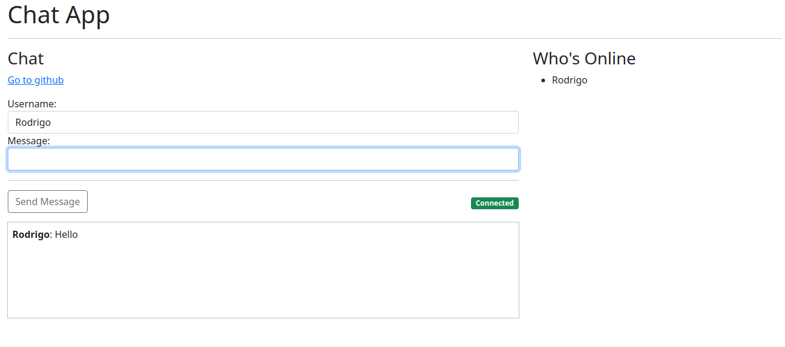

# Chat App in Go

Simple Chat App to undertand how to create websockets in Go. 

The code was developed based on the course [Working With Websockets in Go](https://www.udemy.com/course/working-with-websockets-in-go/).

  

## Usage

From the main folder run `go run cmd/web/*.go`.

